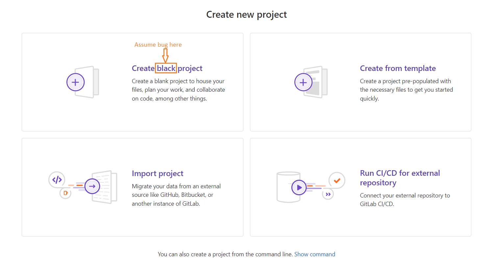

## Summary (Summarize the bug encountered concisely)

When creating project at new project site (https://gitlab.com/projects/new) Create blank project is mispronounced. It shows up as "Create black project".

## Steps to reproduce     

    Document the problem and share the information with team.

## What is the current bug behavior?

    There is miss typo in the code

## What is the expected correct behavior?

    It should show up as: Create blank project
     
## Relevant logs and/or screenshots

      

## Possible fixes

    
Create blank project

## Whom do you report/ Assign To/ Tags

      /label ~bug ~reproduced ~needs-investigation 
      /cc @project-manager 
      /assign @qa-tester

## Priority

    Major
